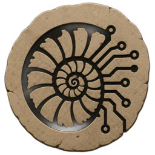

# Amonite

<!--
SPDX-FileCopyrightText: 2026 Manuel Gil
SPDX-License-Identifier: GPL-3.0-or-later
-->

  

  <strong>A carefully integrated Debian-based GNU/Linux distribution.</strong>

  
  
  

Amonite is an independent GNU/Linux operating system built on Debian. It is engineered for what you do after install: desktop work, development, administration, networking, and local artificial intelligence.

Debian provides the platform. Amonite provides a carefully considered set of defaults.

> **Every default is an intentional decision.**

Software earns its place by enabling work. Transitive convenience is not enough.

## Why Amonite exists

Operating systems accumulate. Software, services, integrations, and automation arrive one reasonable decision at a time, and the result is a system harder to understand, adapt, and maintain than any of those decisions suggested.

Amonite asks a different first question:

> **Why should this exist by default?**

A default has to provide a clear capability, justify its presence, and stay useful for the life of the system.

Two rules follow from that one. Anything useful on day one must not become a trap on day thirty. And the person at the keyboard remains in control: defaults are starting points, and replacing one should never mean fighting the system.

Security follows the same reasoning: Debian's mature mechanisms come before additional software, and privacy means reducing unnecessary exposure without removing the user's choice. Lightweight means the lowest practical cost in dependencies, maintenance, and coupling - not the lowest package count for its own sake.

The goal is not to invent a new kind of Linux. The goal is to let Linux remain Linux, and remain yours.

## Who it is for

People who want a coherent day-one desktop without assembling it by hand: development and administration tools ready from the first session, local model inference that does not depend on an external service, and a Debian base that stays understandable and replaceable.

Published editions are **alpha** within the **Nautilus** (1.x) release family. They are meant for evaluation and testing. If you need a production-supported release or guaranteed hardware compatibility, wait. Pre-release images may contain bugs, incomplete features, and compatibility problems.

## What Amonite provides

Published Alpha editions intentionally provide:

- a desktop experience matching the chosen edition;
- guided installation, with optional encryption;
- a live session for evaluation before any installed disk is modified;
- a curated command-line environment for development and administration;
- local AI inference under user control, without depending on external inference services.

These are product commitments, not a catalogue of every application or desktop convenience in a release. Local AI is one deliberate capability among others - Amonite does not claim to be an "AI operating system", the fastest system, or the most secure system.

More detail: [CAPABILITIES.md](CAPABILITIES.md).

## Editions

Amonite is one operating system with multiple editions. They differ in intended experience and maturity, not in philosophy or architecture.

| Edition      | Identity                                            | Maturity                                                                                       |
| ------------ | --------------------------------------------------- | ---------------------------------------------------------------------------------------------- |
| **Standard** | A complete general-purpose desktop operating system | Alpha 2 - [`1.0.0-alpha.2`](https://github.com/ManuelGil/amonite/releases/tag/v1.0.0-alpha.2)  |
| **Lite**     | A lightweight desktop operating system              | Alpha - [`1.0.0-alpha`](https://github.com/ManuelGil/amonite/releases/tag/lite%2Fv1.0.0-alpha) |
| **Mobile**   | An experimental exploration of mobile computing     | Experimental - no public ISO                                                                   |

Standard is the reference edition. Published images target `amd64` personal computers.

Edition details: [EDITIONS.md](EDITIONS.md). Naming and maturity labels: [BRANDING.md](BRANDING.md).

## Architecture

Amonite builds upon Debian rather than replacing it. There is one architecture and every edition inherits it. Product identity and architecture are meant to stay stable while implementations evolve underneath them.

Full detail: [ARCHITECTURE.md](ARCHITECTURE.md).

## Installation

1. Download a published Alpha ISO from [GitHub Releases](https://github.com/ManuelGil/amonite/releases) or [amonite.org/downloads](https://amonite.org/downloads/).
2. Verify the image against its OpenPGP signature and SHA-256 checksum - [VERIFY.md](VERIFY.md).
3. Write the image to a USB flash drive and boot it.
4. Install with the graphical installer - [INSTALL.md](INSTALL.md).
5. After first login, continue with [FIRST_STEPS.md](FIRST_STEPS.md).

Every release artifact is cryptographically signed so that it can be verified independently. You need 64-bit x86 (`amd64`) hardware, BIOS or UEFI firmware, and enough RAM and storage for a Debian desktop install; [INSTALL.md](INSTALL.md) gives the validated reference configuration.

## Documentation map

| Document                           | Purpose                                    |
| ---------------------------------- | ------------------------------------------ |
| [EDITIONS.md](EDITIONS.md)         | Edition identity and public status         |
| [CAPABILITIES.md](CAPABILITIES.md) | Product-defining capabilities              |
| [BRANDING.md](BRANDING.md)         | Naming, versioning, Nautilus               |
| [ARCHITECTURE.md](ARCHITECTURE.md) | Shared architecture and decision hierarchy |
| [INSTALL.md](INSTALL.md)           | Installing the published release           |
| [VERIFY.md](VERIFY.md)             | Verifying release authenticity             |
| [FIRST_STEPS.md](FIRST_STEPS.md)   | After first login                          |
| [CHANGELOG.md](CHANGELOG.md)       | Version history                            |
| [SECURITY](SECURITY)               | Security policy                            |
| [CONTRIBUTING.md](CONTRIBUTING.md) | How to contribute                          |
| [security/](security/)             | Release signing key                        |

Documentation records present maturity. It does not predict future releases.

## Community

Questions, feedback, bug reports, and general discussion belong on [r/Amonite](https://www.reddit.com/r/amonite/). Official ISOs, checksums, signatures, and release notes are published through [GitHub Releases](https://github.com/ManuelGil/amonite/releases), and [amonite.org](https://amonite.org/) hosts downloads, the gallery, and project pages.

## Contributing

Amonite is designed, built, tested, cryptographically signed, and maintained by Manuel Gil as an independent project. Feedback from real installs is the most useful contribution - see [CONTRIBUTING.md](CONTRIBUTING.md). Optional sponsorship goes through [GitHub Sponsors](https://github.com/sponsors/ManuelGil).

## License

Amonite is free software released under the GNU General Public License v3.0 or later. See [LICENSE](LICENSE) for the complete text.

Third-party software retains its respective licenses.
